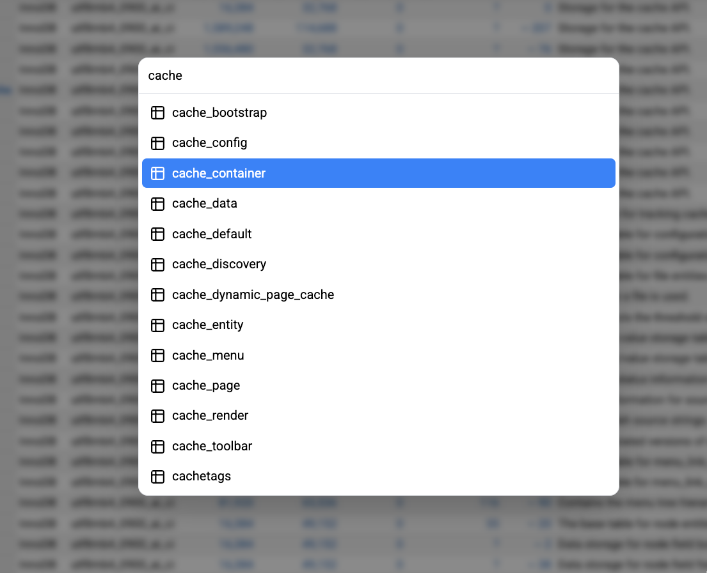

# Adminer Command Palette

A command palette plugin for [Adminer](https://www.adminer.org) that provides quick navigation to databases and tables using keyboard shortcuts.

Neither bragging, nor ashamed – it was written almost entirely by Cursor + Sonnet 4.



## Features

🚀 **Quick Access**: Press `Cmd+K` (Mac) or `Ctrl+K` (Windows/Linux) to open

🔍 **Fuzzy Search**: Smart search with intelligent ranking

⌨️ **Keyboard Navigation**: Full keyboard support with arrow keys

🖱️ **Mouse Support**: Seamless mouse and keyboard interaction

📊 **Table Priority**: Tables are prioritized over databases in search results

🎨 **Modern UI**: Clean, responsive design with hover effects

## Installation & Usage

### Setup
1. Download `command-palette.php` from this repository
2. Place it in your `adminer-plugins/` directory next to your `adminer.php` file
3. Create or update your `adminer-plugins.php` file to include the plugin:

```php
<?php // adminer-plugins.php
return array(
    new AdminerCommandPalette(),
    // You can add other plugins here
);
```

For detailed plugin installation instructions, see the [official Adminer plugins documentation](https://www.adminer.org/en/plugins/#use).

### Keyboard Shortcuts
- **`Cmd+K` / `Ctrl+K`**: Open/close command palette
- **`Arrow Up/Down`**: Navigate through results
- **`Enter`**: Select and navigate to item
- **`Escape`**: Close palette
- **`Cmd+J` / `Ctrl+J`**: Copy search results as JSON (debug mode)

### Search Tips
- Search is case-insensitive and supports partial matches
- Tables are shown before databases in results
- Exact matches are prioritized over fuzzy matches
- Type part of a table or database name to quickly find it

## Requirements

- **Adminer 5.x** (this plugin only works with Adminer 5)
- Modern browser with JavaScript enabled
- CSP-compliant (uses nonce for inline scripts)

## License

The MIT License (MIT). Please see [License File](LICENSE.md) for more information.
